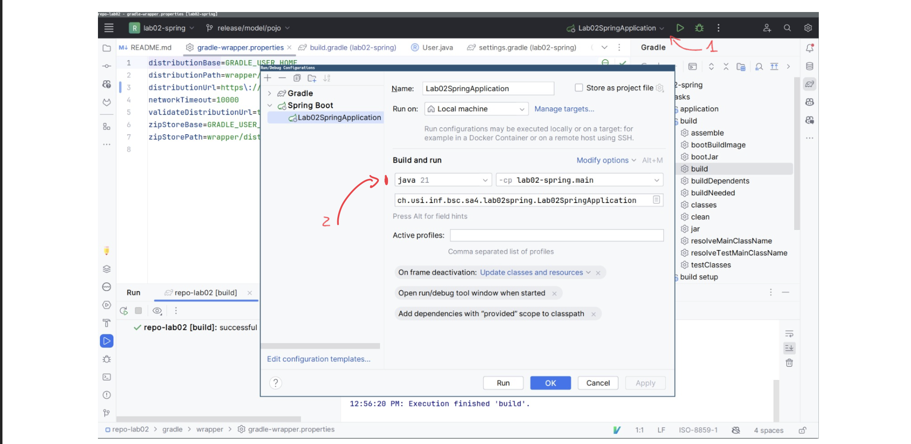
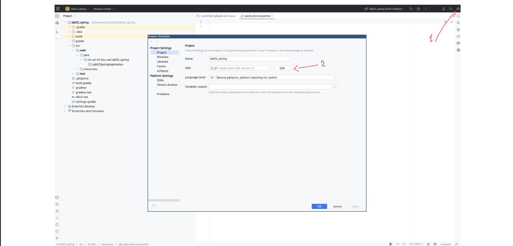
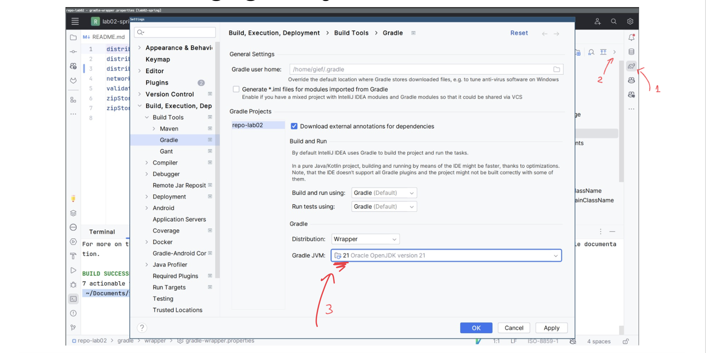

# Tutorial

_This tutorial is for the whole team to have a guide in case they need it. There are also some mandatory steps so that we have a complete and equal setup for everyone. Finally, we have included the most common problems you might encounter and their solutions.
If you have any suggestions for adding more tips, please contact the leaders and let them know your ideas._

## Contents

* [First Setup](#first-setup)
    * [Install MongoDB](#to-install-mongodb-use-these-commands)
    * [Install GUI MongoDB](#to-install-a-gui-mongodb-client)
    * [Install Postman](#to-install-postman)
* [How to Connect the Database](#how-to-connect-your-intellij-to-your-database)
* [What to Do Now](#what-to-do-now)
* [Common Problems](#common-problems)


## First Setup

First,
you need
to follow the professor's tutorial on how to install MongoDB and both MongoDB and Postman applications on your computer.
If you have already done this, skip to [How to Connect the Database](#how-to-connect-your-intellij-to-your-database) or [What
to Do Now](#what-to-do-now). In case you haven't done anything yet, here is a brief tutorial:

#### To install MongoDB, use these commands
```shell
  brew tap mongodb/brew
```

```shell
  brew install mongodb-community
```

```shell
  brew services start mongodb-community
```

#### To install a GUI MongoDB client
```shell
  brew install mongodb-compass
```

#### To install Postman
```shell
  brew install postman
```

## How to Connect Your IntelliJ to Your Database

To start running your database, you have to use this command
```shell
  brew services start mongodb-community
```
Then you have to open MongoDB compass application. If it is your first time, you have to click on `add new connection` and then `save & connect`. Otherwise, you have just to click on the `connect` button for your `localhosts:27017` database.\
After that you have to move to the backend folder and then use the command `./gradlew bootRun`.

<div style="border: 1px solid #007BFF; background-color: #cce5ff; color: #004085; padding: 10px; border-radius: 4px; margin: 1em 0;">
  If an error occurs, try to fix it yourself without creating more errors. If you cannot, contact one of the team leaders.
</div>

When you have finished working on your database, you have to run this command to turn off your database
```shell
  brew services stop mongodb-community
```

## What to Do Now

Go to your [GitLab account](https://gitlab.com/) and browse the available issues. If you find an issue you're interested in working on, contact one of the team leaders to request assignment to that issue.\
Afterward, create a Merge Request and add the team leaders as reviewers.

Now you need to do a `git pull` from the dev branch and then `git checkout name-new-branch-for-your-issue`. Now you can work on it.

When you have finished modifying all your code, you need to test it, first move to the backend folder and then use the command `./gradlew test`.

If everything works correctly and all the tests pass, you can try to merge the code. Here is what you should do:
- Use `git pull origin dev` again
    - If there are no modifications, you can proceed
    - If there are some modifications, you need to test it if everything works again. If there are no problems, you can proceed with the following steps; otherwise, you need to modify and re-check everything.
- Now you can use `git add .`, `git commit -m "message"`, `git push`.
- Finally, you need to wait until the team leaders approve your merge. If they don't approve it, there are probably some comments that you need to follow to complete your issue.

## Common Problems

<div style="border: 1px solid #ff001c; background-color: #69000a; padding: 10px; border-radius: 4px; margin: 1em 0;">
    error: invalid source release: 21
</div>

#### Check the Java version in Spring Boot configuration


#### Check the SDK version in project structure configuration


#### Check Gradle JVM setting = 21


**If the error on intelliJ is**
<div style="border: 1px solid #ff001c; background-color: #69000a; padding: 10px; border-radius: 4px; margin: 1em 0;">
  Caused by: java.net.ConnectException: Connection refused
</div>

**or the error on MongoDB compass application is**
<div style="border: 1px solid #ff001c; background-color: #69000a; border-radius: 4px; margin-top: 1em; padding: 10px 10px 0;">
  connect ECONNREFUSED 127.0.0.1:27017, connect ECONNREFUSED ::1:27017

There was a problem connecting to localhost:27017
</div>

#### Check MongoDB status with

```shell
  brew services info mongodb-community
```

If it is off, use this command:

```shell
  brew services start mongodb-community
```
<div style="border: 1px solid #007BFF; background-color: #cce5ff; color: #004085; padding: 10px; border-radius: 4px; margin: 1em 0;">
If it's on, and it still doesn't work, contact one of the team leaders.
</div>